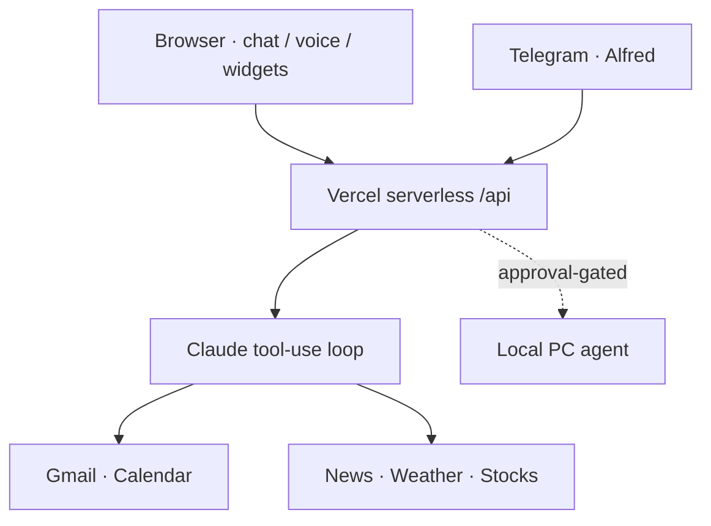

# J.A.R.V.I.S

**Personal AI Command Center** — a cyberpunk-styled web dashboard backed by Claude, a Telegram butler named Alfred, live data widgets, a voice interface, and an optional local-agent that gives the AI controlled access to your PC.

**Live demo:** https://cyber-jarvis.vercel.app

---

## What it is

JARVIS is a single-owner personal dashboard deployed on Vercel. The frontend is a static HTML/CSS/JS app styled like an Iron Man HUD. It talks to a thin layer of Vercel serverless functions (`api/`) that proxy Claude (Anthropic) for chat, pull live weather/news/stocks, and handle a Telegram webhook for the "Alfred" assistant persona. An optional local Node.js agent (`local-agent/`) runs on your PC and accepts commands from the dashboard or Telegram over a secured WebSocket or HTTP tunnel, enabling file reads, shell commands, and Obsidian vault writes — all gated behind explicit approval tokens.

---

## Architecture at a glance



## Features

- **AI chat panel** — full Claude conversation with tool-use loop (weather, news, stocks, web search, briefings); live token counter; searchable history; image attachment support
- **Voice interface** — Web Speech API for speech-to-text input and browser TTS for spoken responses; continuous voice-mode with auto-restart; dedicated `voice.html` for mobile use; keyboard shortcut `Alt+V`
- **Live HUD widgets** — draggable, auto-refreshing panels for weather (geolocation-aware), top news headlines, and stock/market data
- **Daily briefing** — on-demand AI-composed summary of weather, news, calendar, and tasks via `/api/briefing`
- **Kanban task board** — localStorage-backed to-do board with drag-and-drop columns and server sync
- **Telegram butler ("Alfred")** — Claude agent with a British-butler persona; reads Gmail, manages Google Calendar, checks weather/news/markets, searches the web, controls the PC (with approval), writes to the Obsidian vault; multi-step tool-use loop; voice-message support
- **PWA + push notifications** — service worker (`sw.js`) for installability and Web Push; scheduled cron alerts via Vercel Crons
- **Google OAuth integration** — optional Gmail and Google Calendar access via `api/auth/`
- **Local PC agent** — optional Node.js server (`local-agent/server.js`) that exposes filesystem reads/writes and safe shell commands over an authenticated WebSocket; separate HTTP bridge (`http-bridge.js`) tunnelled via Cloudflare for Telegram-initiated PC control
- **Approval-gated command execution** — every privileged local action is validated against a command allowlist and an approval-token TTL before it runs

---

## Architecture

```
Browser (index.html / voice.html)
  │
  ├── js/jarvis.js        — Claude chat engine, tool-use orchestration
  ├── js/voice.js         — Web Speech API (STT + TTS)
  ├── js/widgets.js       — Weather / news / stocks HUD panels
  ├── js/tasks.js         — Kanban board (localStorage)
  ├── js/notifications.js — Toast + Web Push subscriptions
  └── sw.js               — Service worker (PWA, push notifications)
  │
  └── Vercel Serverless API (api/)
        ├── chat.js         — Claude chat endpoint (tool-use loop)
        ├── telegram.js     — Telegram webhook / Alfred brain
        ├── briefing.js     — Daily briefing generator
        ├── weather.js      — Weather data proxy
        ├── news.js         — News proxy
        ├── stocks.js       — Market data proxy
        ├── search.js       — Web search proxy
        ├── gmail.js        — Gmail read/draft (Google OAuth)
        ├── alerts.js       — Alert rules engine
        ├── cron-alerts.js  — Vercel Cron scheduled alerts
        ├── status.js       — Health / system status endpoint
        └── auth/           — Google OAuth callback

  lib/
    ├── alfred.js    — Alfred system prompt, tool definitions, model selector
    ├── memory.js    — Persistent memory (Obsidian vault via local agent)
    ├── voice.js     — Telegram voice message handler (STT/TTS helpers)
    └── calendar.js  — Google Calendar helpers

  local-agent/               (runs on your PC, optional)
    ├── server.js            — WebSocket server (filesystem + shell access)
    ├── http-bridge.js       — HTTP server (Telegram → PC bridge via Cloudflare)
    ├── openclaw-launcher.js — Spawns coding tasks (Claude Code / OpenClaw)
    └── openclaw-security.js — Command allowlist + approval-token validation
```

---

## Tech stack


| Layer | Technology |
|---|---|
| Frontend | Vanilla HTML/CSS/JS, Web Speech API, Web Push |
| API layer | Vercel Serverless Functions (Node.js 18+) |
| AI | Anthropic Claude via `@anthropic-ai/sdk` |
| Telegram | Telegram Bot API (webhook mode) |
| Local agent | Node.js + `ws` (WebSocket server) |
| Auth | Google OAuth 2.0 (Gmail + Calendar) |
| Deployment | Vercel (static output + serverless functions + crons) |

---

## Getting started

### Prerequisites

- Node.js 18+
- A [Vercel](https://vercel.com) account and the Vercel CLI
- An Anthropic API key
- (Optional) NewsAPI key, Telegram bot token, Google OAuth credentials

### Install and run locally

```bash
git clone https://github.com/liamssbusiness/jarvis.git
cd jarvis
npm install

cp .env.example .env   # then fill in the variables below
npm run dev            # local dev via Vercel CLI
```

### Deploy

```bash
npm run deploy
```

### Run the optional local PC agent

```bash
cd local-agent
npm install
LOCAL_AGENT_SECRET=your-random-secret node server.js
# For the Telegram → PC tunnel:
LOCAL_AGENT_SECRET=your-random-secret node http-bridge.js
# then: npx cloudflared tunnel --url http://localhost:3002
```

### Environment variables

| Variable | Required | Description |
|---|---|---|
| `ANTHROPIC_API_KEY` | Yes | Anthropic API key for Claude |
| `NEWS_API_KEY` | No | newsapi.org key for the news widget |
| `GOOGLE_CLIENT_ID` | No | Google OAuth client ID |
| `GOOGLE_CLIENT_SECRET` | No | Google OAuth client secret |
| `GOOGLE_REDIRECT_URI` | No | OAuth redirect URI |
| `TELEGRAM_BOT_TOKEN` | No | Telegram bot token for Alfred |
| `TELEGRAM_USER_ID` | No | Authorized Telegram user ID |
| `LOCAL_AGENT_SECRET` | No | Shared secret for PC-agent auth |
| `LOCAL_AGENT_URL` | No | URL of the running local agent |

---

## Project structure

```
jarvis/
├── index.html          # Main dashboard UI
├── voice.html          # Standalone mobile voice interface
├── sw.js               # Service worker (PWA + push)
├── vercel.json         # Vercel config, routes, crons
├── package.json
├── css/                # Styles
├── js/                 # Frontend modules
├── api/                # Vercel serverless functions
├── lib/                # Shared server-side helpers
├── local-agent/        # Optional local PC agent (separate Node app)
└── docs/               # Setup guides (OAuth, alerts, local agent)
```

---

Built by [Liam Schnorr](https://github.com/liamssbusiness)
